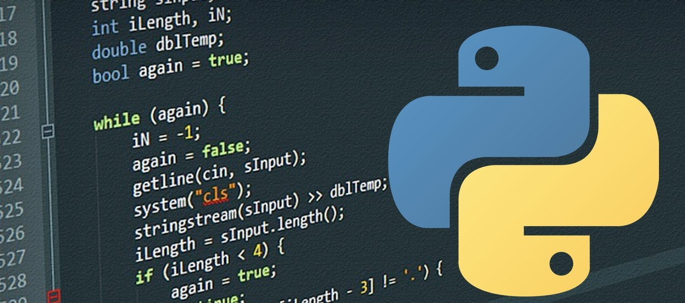

# Intérprete de Python

Al instalar Python se nos instalará también su interprete con el que podremos crear ejecutar programas de Python para acceder a el en linux simplemente debemos abrir una terminal y ejecutar el siguiente comando:

      python3

Una vez abierto nuestra consola estará asi:

      Python 3.8.5 (default, Jul 28 2020, 12:59:40) 
      [GCC 9.3.0] on linux
      Type "help", "copyright", "credits" or "license" for more information.
      >>>
 
Ahora podemos crear y ejecutar programas empecemos por el clásico Hola Mundo escribiendo la siguiente linea y pulsando enter:

      print("Hello World")

Tras esto nuestra consola estará así:

      Python 3.8.5 (default, Jul 28 2020, 12:59:40) 
      [GCC 9.3.0] on linux
      Type "help", "copyright", "credits" or "license" for more information.
      >>> print("Hello World")
      Hello World
      >>> 

Para cerrar el interprete escribiremos el siguiente comando y pulsaremos enter:

      exit()

También podemos ejecutar ficheros .py para ello abriremos una terminal y nos iremos al directorio en el que se encuentre el archivo una vez allí escribiremos lo siguiente:

      python3 file.py

Siendo file.py el nombre del fichero que queramos ejecutar.

Puedes hacer la prueba descargando y ejecutando el siguiente archivo: <a href="/examples/01-holamundo/holamundo.py" download>holamundo.py</a>