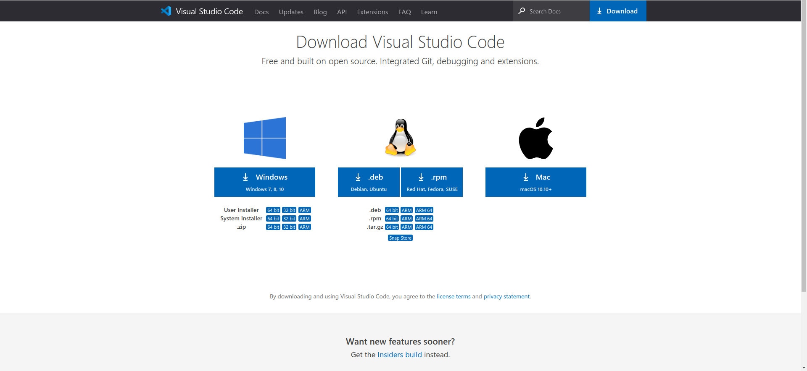
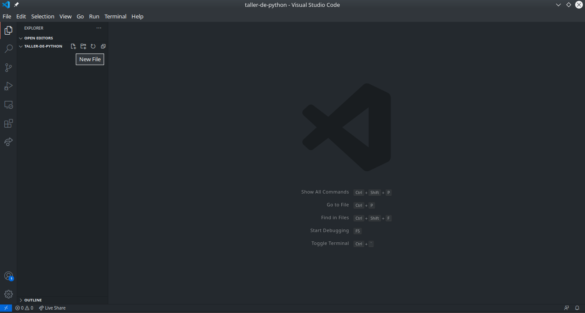
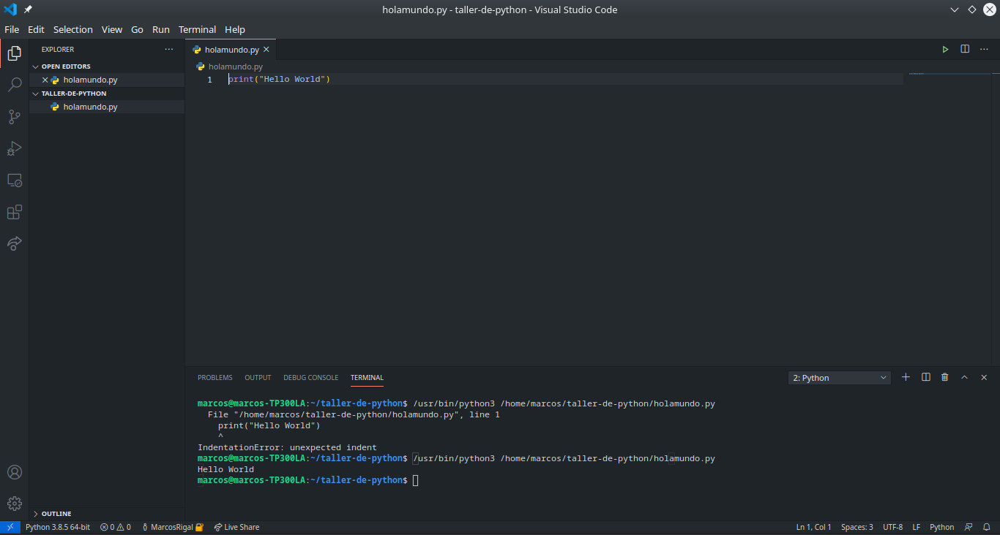

# Entorno de Trabajo

Nosotros en este taller trabajaremos con Visual Studio Code ya que cuenta con una gran variedad de extensiones que nos serán de utilidad a la hora de desarrollar. Ademas cuenta con una terminal integrada en la que podremos ejecutar facilmente los programas que vayamos realizando.

También crearemos una carpeta en la que iremos guardando los programas que hemos realizado.

Esta carpeta deberemos abrirla en Visual para que el flujo de trabajo sea lo mas fluido posible. 

## Pasos

### 1. Instalar VSCode

Simplemente clicamos en el siguiente enlace y descargamos la versión para nuestro sistema operativo: [https://code.visualstudio.com/download](https://code.visualstudio.com/download)

### 2. Crear la carpeta

      mkdir taller-de-python

### 3. Abrir la carpeta en VSCode

Abrimos la carpeta 

Creamos un nuevo fichero que se llame holamundo.py

Ahora se nos abrirá el archivo que acabamos de crear. Aquí ya podemos comenzar a hacer nuestros programas y como no podía ser de otra forma el primer programa que haremos será imprimir un hello world para ello copiaremos el siguiente código y lo pegaremos en el archivo acto seguido pulsaremos el botón verde de play que se encuentra arriba a la derecha para ejecutarlo.

            print("Hello World")

Si has seguido los pasos al pie de la letra te habrás dado cuenta que al ejecutarlo sale un error de indentación. Esto se debe a que a diferencia de otros lenguajes como C++, Python es sensible a las indentaciones ya que estas reemplazan a los paréntesis.

Para que el programa anterior funcione simplemente debemos eliminar las indentaciones sobrantes y volver a pulsar *Play*. Hecho esto deberíamos de haber obtenido un resultado similar al que obtuvimos en el apartado anterior con el intérprete

Una vez hemos hecho nuestro primer programa llega la hora de profundizar un poco más en este lenguaje. Para ayudar a relacionar conceptos y entenderlo todo un poco mejor todos los ejemplos de código del curso estarán acompañados de una implementación similar en C++ que puede ser compilada y ejecutada para comprobar los resultados y ver las similitudes y diferencias entre ambos lenguajes.
