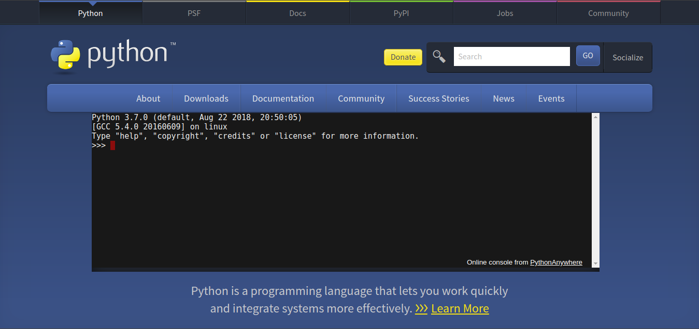

# Instalación

Ubuntu 20.04 y otras versiones de Debian Linux se entregan con Python 3 preinstalado. Para asegurarnos de que nuestras versiones estén actualizadas, ejecutaremos los siguientes comandos:

      sudo apt update && apt upgrade

Una vez completado el proceso, podemos comprobar la versión de Python 3 instalada en el sistema escribiendo lo siguiente:

      python3 -V

Para instalar Python en otros sistemas operativos tales como Windows o MacOS, descargar el instalador correspondiente de la web de Python: 

[https://www.python.org/downloads/](https://www.python.org/downloads/)

Para gestionar los paquetes de software para Python, instalaremos pip, una herramienta que instalará y gestionará los paquetes de programación que queramos utilizar en nuestros proyectos de desarrollo:

      sudo apt install -y python3-pip

Hay más paquetes y herramientas de desarrollo que debemos instalar para asegurarnos de contar con una configuración sólida para nuestro entorno de programación:

      sudo apt install -y build-essential libssl-dev libffi-dev python3-dev

Virtualenv se usa para administrar paquetes de Python de diferentes proyectos. El uso de virtualenv permite evitar instalar paquetes de Python a nivel global, lo que podría dañar las herramientas del sistema u otros proyectos. Podemos instalar virtualenv usando pip:

      pip3 install --user virtualenv

Para más información sobre los usos de esta herramienta visite la siguiente web:

[https://virtualenv.pypa.io/en/latest/index.html](https://virtualenv.pypa.io/en/latest/index.html)
